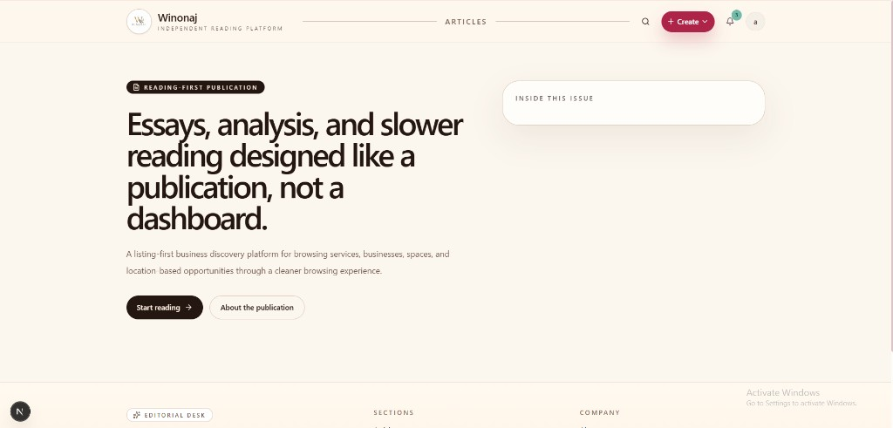
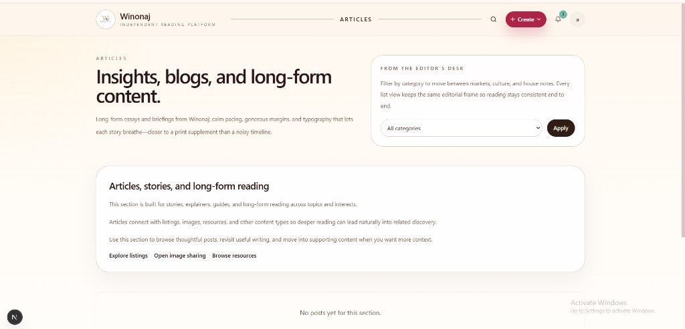
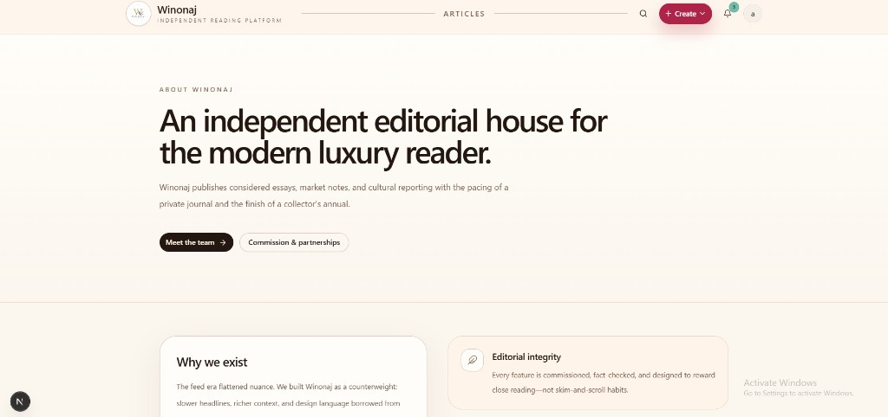
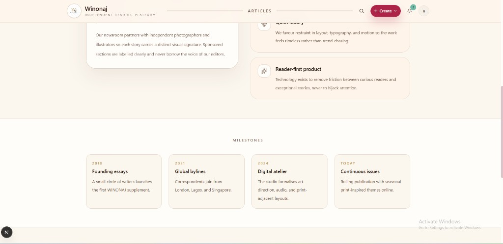
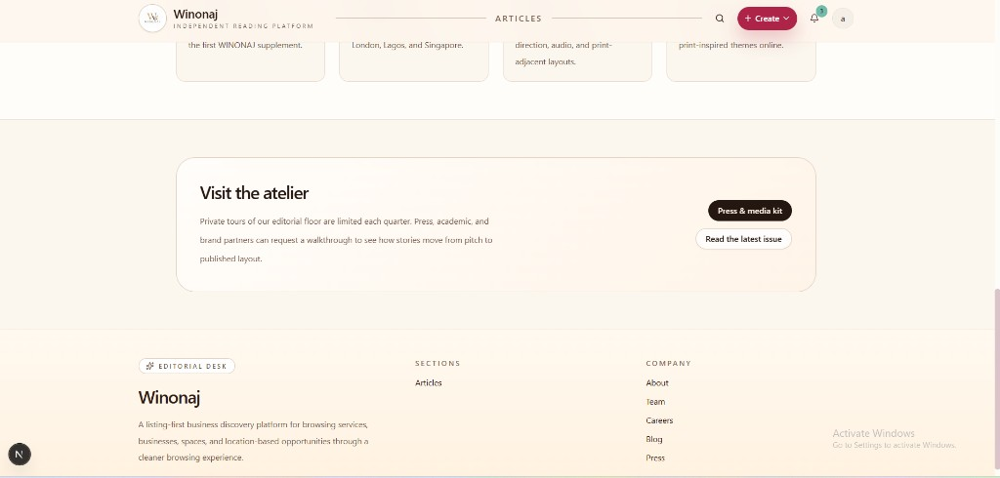

# Winonaj

Independent reading platform — editorial layout, warm cream palette, and typography tuned for long-form reading.

## UI preview

Screenshots below are stored in-repo so they render on GitHub without external hosting.

### Home

### Articles

### About (hero)

### About (milestones & pillars)

### Footer & call to action

